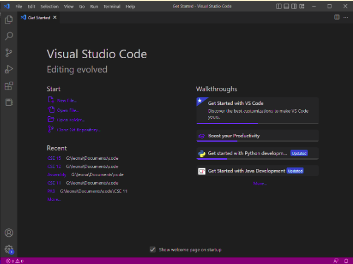
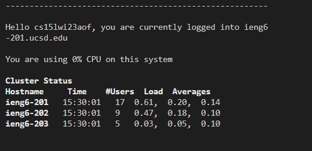
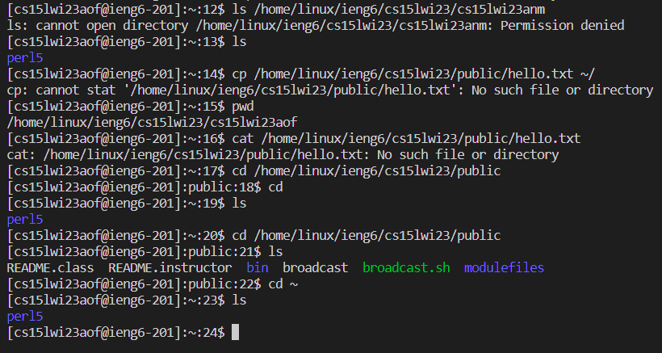
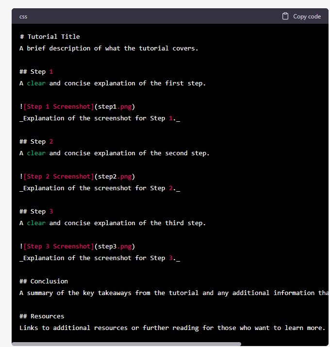

# CSE 15L Lab Report 1: Remote Access and file system
In this lab we go through a tutorial on how to install VScode, how to connect remotely to 
the UCSD servers, and how to use file system commands in the virtual or local directories. 

 
 

## Step 1: Installing VScode
While I already had VScode installed, so I didn't have to do it in lab, I do know the steps.
The first step is to go to https://code.visualstudio.com/ and download the program by following
the instructions. Once it is open it will look something like this on Windows:

_Here we can see visual studio open and working on the home page._  

 
 

## Step 2: Remotely connecting
If you're on Windows like me, your first step will be to install git bash so the command interface is consistent with
what we learn in the class. At https://gitforwindows.org/ you can find it. 

Once you have git bash installed you will need to create your course specific username for CSE 15L
by going to https://sdacs.ucsd.edu/~icc/index.php . Now that we have that username, we can "ssh"
into the remote server by typing: 
> ssh "course username".ieng6.ucsd.edu

If you get a yes/no prompt, answer yes, and then you will be prompted to input a password.
The password is the one you set for your course specific user. Once the passcode is successfuly input, 
you should see an output that looks like this: 

_Here we see that I was logged into the 201 server, one of three._ 

 
 

## Step 3: Trying some commands
Now that we're connected to the remote server, we can use the same directory commands we learned about for local files
on this remote directory. The lab report gives this list of commands as an example:

* cd ~
* cd
* ls -lat
* ls -a
* ls <directory> where <directory> is /home/linux/ieng6/cs15lwi23/cs15lwi23abc, where the abc is one of the other group members’ username
* cp /home/linux/ieng6/cs15lwi23/public/hello.txt ~/
* cat /home/linux/ieng6/cs15lwi23/public/hello.txt

Using a combination of these and other commands, I received the following output:

_Here is a set of shown inputs and outputs._

The first command is the one I found most interesting. I got the username of my partner, and 
attempted to view the files in his repository by using the 'ls' command, but it noticed I did not have permission.

The other commands show that this directory works just like our local directories.

 
 

## Resources
Links to additional resources or further reading for those who want to learn more.

ChatGPT was used to generate a basic version of the Markdown format for a tutorial with three steps, the output is shown:

