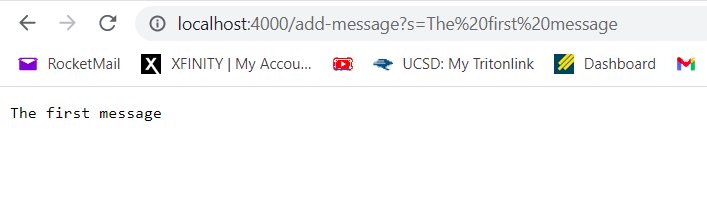
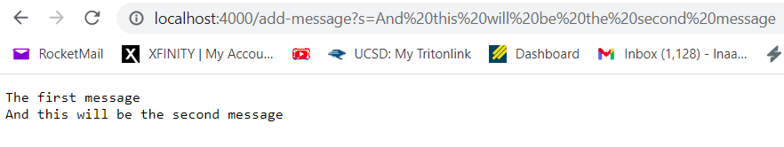
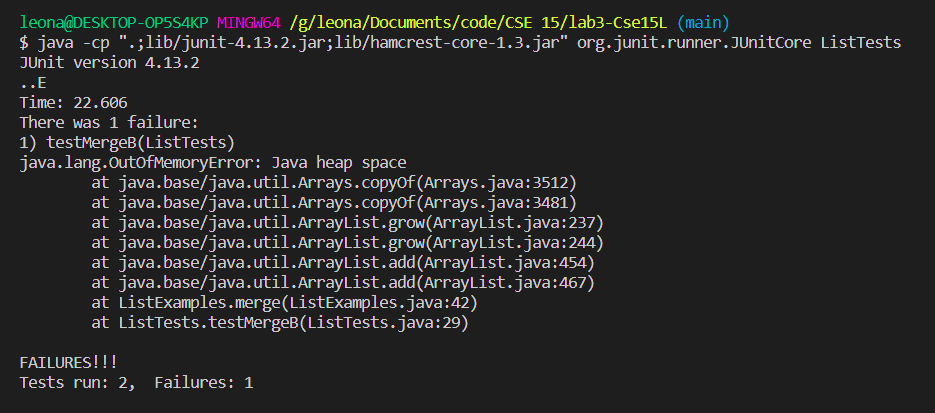
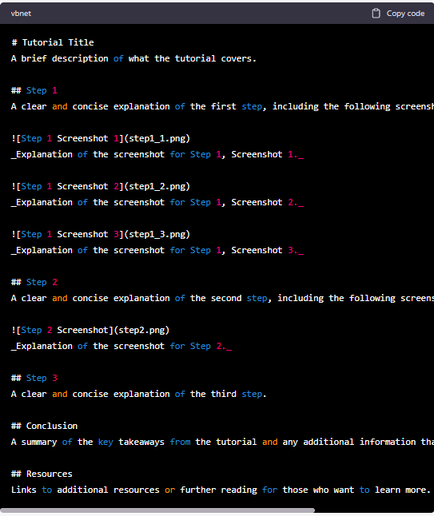

# Servers and Bugs
In this lab we look at how servers host a website, and also go over debugging ideas and technique. We
will look at how to make a program that handles requests in the form of URI paths, and how to 
make a website with that in mind. And for debuggin we will look at the core definition of
bugs, symptoms, and how to categorize an issue.

## Step 1: Web Server 
In this part of the lab, we are tasked with creating a class called StringServer that will 
host a web server and handle requests. The first step is to build a handler that implements
the java URLHandler interface. That is, we are to make a class that defines the methods
outlined in the URLHandler. Once we have designed our implementation, and allowed it to 
handle our expected requests, in this case "add-message?s=*ourString*", we can create
the StringServer class which calls this class in its main and creates the web server.

~~~java
import java.io.IOException;
import java.net.URI;

class stringHandler implements URLHandler {

    String theString = "";

    public String handleRequest(URI url) {
        if (url.getPath().equals("/")) {
            return theString;
        } 
        else if (url.getPath().contains("/add-message")) {
            
            String[] parameters = url.getQuery().split("=");
            if (parameters[0].equals("s")) {
                theString = theString + parameters[1] + "\n";
                return theString;
            }
            return "404 Not Found!";

        } else {
            System.out.println("Path: " + url.getPath());
            
            return "404 Not Found!";
        }

    }
}

class StringServer {
    public static void main(String[] args) throws IOException {
        if(args.length == 0){
            System.out.println("Missing port number! Try any number between 1024 to 49151");
            return;
        }

        int port = Integer.parseInt(args[0]);

        Server.start(port, new stringHandler());
    }
}
~~~
 

After calling Stringserver and giving it a command line argument for the port, we get this
local web server: 

  
_Here the input path is add-message?s=The first message._

In this example the URI called url gets the whole url as a string. getPath returns the path portion
of the url. and theString is currently empty. When the path is checked to include the add-message
key word, then the = delimiter is used to separate the string from the command, and that
string is added to the currently empty string. theString is then appended with a \n return character.

 
 

_Here the input path is add-message?s=And this will be the second message._

In this case, the new url variable will hold the newer longer url. However, theString still has date from the previous 
request. Once the path is checked to have the add-message key, the string will have the new message appended as well
as another endline character. 

 
 

## Step 2: Debugging
In this part of the lab, we look into how to debug in a formulaic way. We start by defining a bug,
a symptom, and interpreting them based in expected versus actual output. In this case, a bug is something
in the progream that causes the program to not work as expected, and a symptom is a specific case of the program
not having an expected output.

Failure inducing input:

~~~java
@Test
    public void testMergeB(){
        String[] theArray = {"a", "cheery"};
        ArrayList<String> theList1 = new ArrayList<String>(Arrays.asList(theArray));
        theArray = new String[] {"bright","day", "eh?"};
        ArrayList<String> theList2 = new ArrayList<String>(Arrays.asList(theArray));
        String[] outArray = {"a","bright", "cheery","day", "eh?"};

        ArrayList<String> theMergedList = new ArrayList<String>(ListExamples.merge(theList1, theList2));

        assertArrayEquals(theMergedList.toArray(),outArray);
        
    }
~~~
 

passing input:

~~~java
public void testMergeA(){
        String[] theArray = {"a", "cheery", "eh?"};
        ArrayList<String> theList1 = new ArrayList<String>(Arrays.asList(theArray));
        theArray = new String[] {"bright","day"};
        ArrayList<String> theList2 = new ArrayList<String>(Arrays.asList(theArray));
        String[] outArray = {"a","bright", "cheery","day", "eh?"};

        ArrayList<String> theMergedList = new ArrayList<String>(ListExamples.merge(theList1, theList2));

        assertArrayEquals(theMergedList.toArray(),outArray);
    }
~~~

 

Symptom: running out of heap

_After about a minute the test failed._

 

before: 

~~~Java
    // Takes two sorted list of strings (so "a" appears before "b" and so on),
    // and return a new list that has all the strings in both list in sorted order.

  static List<String> merge(List<String> list1, List<String> list2) {
    List<String> result = new ArrayList<>();
    int index1 = 0, index2 = 0;
    while(index1 < list1.size() && index2 < list2.size()) {
      if(list1.get(index1).compareTo(list2.get(index2)) < 0) {
        result.add(list1.get(index1));
        index1 += 1;
      }
      else {
        result.add(list2.get(index2));
        index2 += 1;
      }
    }
    while(index1 < list1.size()) {
      result.add(list1.get(index1));
      index1 += 1;
    }
    while(index2 < list2.size()) {
      result.add(list2.get(index2));
      index1 += 1;
    }
    return result;
  }
~~~

 

after:
~~~java
static List<String> merge(List<String> list1, List<String> list2) {
    List<String> result = new ArrayList<>();
    int index1 = 0, index2 = 0;
    while(index1 < list1.size() && index2 < list2.size()) {
      if(list1.get(index1).compareTo(list2.get(index2)) < 0) {
        result.add(list1.get(index1));
        index1 += 1;
      }
      else {
        result.add(list2.get(index2));
        index2 += 1;
      }
    }
    while(index1 < list1.size()) {
      result.add(list1.get(index1));
      index1 += 1;
    }
    while(index2 < list2.size()) {
      result.add(list2.get(index2));
      index2 += 1;
    }
    return result;
  }
~~~
 

The fix was actually quite simple. The issue was that once one list is entirely added to the new sorted list, all
of the remaining elements in the other list must be added to the end of the merged list. This was accomplished
with two while loops. However, in one of the while loops, the index was index1 when it needed to be index2. 
This caused an infinite loop.

## Step 3
One of the coolest things I learned in these labs was just how server hosting works. I had no idea 
about how local web servers were a thing either. 

I also really appreciate having a formal and structured way of thinking about bugs and debugging.

## Resources

ChatGPT was used to provide a template for the markdown file. THe template provided is shown:
