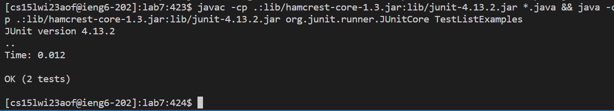

# Lab 4 Report

*Leo Naab; A17172729*


In this tutorial we looked into techniques to maximize our speed working with simple
commands in the remote workspace.
<br/>
<br/>

## Step 1: Login

<br/>

```
<Up-arrow> <ENTER>
```
<br/>
In order to get to my username, I pressed up arrow once to my saved ssh command input and hit enter.

<br/>
<br/>

## Step 2: Cloning fork

<br/>

```
<Up-arrow><Up-arrow><Up-arrow><Up-arrow><Up-arrow><Up-arrow><Up-arrow>
<Up-arrow><Up-arrow><Up-arrow><Up-arrow><Up-arrow> <ENTER>
```

<br/>
In this step I pressed up-arrow 12 times to my saved git clone input shown, and hit enter.

<br/>
<br/>


## Step 3: Running tests


<br/>

```
<Up-arrow><Up-arrow><Up-arrow><Up-arrow><Up-arrow><Up-arrow><Up-arrow>
<Up-arrow><Up-arrow><Up-arrow><Up-arrow><Up-arrow><Up-arrow> <ENTER>

<Up-arrow><Up-arrow><Up-arrow><Up-arrow><Up-arrow><Up-arrow><Up-arrow>
<Up-arrow><Up-arrow> <ENTER>
```

<br/>

In this case I had to hit up-arrow 13 times to get to the cd lab 7 command (not very efficient)
and then had to hit up-arrow 9 times to get to the Javac and Java command shown: 

javac -cp .:lib/hamcrest-core-1.3.jar:lib/junit-4.13.2.jar *.java && java -cp .:lib/hamcrest-core-1.3.jar:lib/junit-4.13.2.jar org.junit.runner.JUnitCore TestListExamples

<br/>
<br/>


## Step 4: Code editing


<br/>

```
<Up-arrow><Up-arrow><Up-arrow><Up-arrow><Up-arrow><Up-arrow><Up-arrow>
<Up-arrow><Up-arrow><Up-arrow><Up-arrow><Up-arrow><Up-arrow><Up-arrow> <ENTER>

<down-arrow><down-arrow><down-arrow><down-arrow><down-arrow>
<down-arrow><down-arrow><down-arrow><down-arrow><down-arrow>
<down-arrow><down-arrow><down-arrow><down-arrow><down-arrow>
<down-arrow><down-arrow><down-arrow><down-arrow><down-arrow>
<down-arrow><down-arrow><down-arrow><down-arrow><down-arrow>
<down-arrow><down-arrow><down-arrow><down-arrow><down-arrow>
<down-arrow><down-arrow><down-arrow><down-arrow><down-arrow>
<down-arrow><down-arrow><down-arrow><down-arrow><down-arrow>
<down-arrow><down-arrow><right-arrow><right-arrow><right-arrow>
<right-arrow><right-arrow><right-arrow><right-arrow><right-arrow>
<right-arrow><delete> 1

<ctrl>+<o> <enter> <ctrl>+x
```

<br/>

In this part I had to hit up arrow 14 times to get to nano ListExamples.java, hit enter,
and then had to go down 42 lines, right 9 characters, delete a character, and write a 1.

After that I needed to save by hitting control plus o, and hitting enter, and then exitting by hitting 
control + x.

<br/>
<br/>


## Step 5: Rerunning tests

<br/>

```
<Up-arrow><Up-arrow> <ENTER>
```
<br/>

In this step I pressed up-arrow 2 times to my compile and run input shown, and hit enter.
<br/>
<br/>

## Step 6: Push changes

<br/>

```
<Up-arrow><Up-arrow><Up-arrow><Up-arrow><Up-arrow><Up-arrow><Up-arrow>
<Up-arrow><Up-arrow><Up-arrow><Up-arrow><Up-arrow><Up-arrow> <Up-arrow>
<Up-arrow> <ENTER>

<Up-arrow><Up-arrow><Up-arrow><Up-arrow><Up-arrow><Up-arrow><Up-arrow>
<Up-arrow><Up-arrow><Up-arrow><Up-arrow><Up-arrow><Up-arrow> <Up-arrow>
<Up-arrow> <ENTER>

<Up-arrow><Up-arrow><Up-arrow><Up-arrow><Up-arrow><Up-arrow><Up-arrow>
<Up-arrow><Up-arrow><Up-arrow><Up-arrow><Up-arrow><Up-arrow> <Up-arrow>
<Up-arrow> <ENTER>
```
<br/>

In this step I had to hit up arrow 15 times to get to "git add ." then 15 more times to 
get to "git commit -m "done"", then 15 more times to get to "git push origin main", hitting
enter after getting to each command.
<br/>
<br/>


## References
<br/>
ChatGPT was used to create the markdown outline.