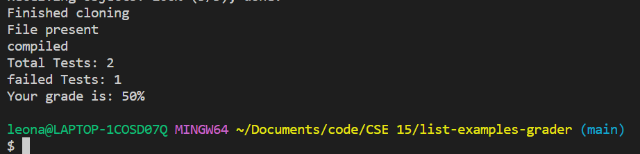
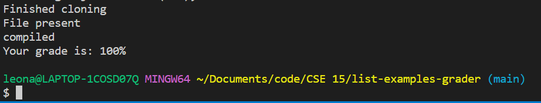
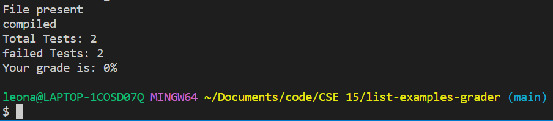

# Lab Report 5: Finishing the grading script

## Introduction
In this lab report I will go back to the grade.sh script and make it a more usable script.
<br/>
<br/>

## Background
I had a lot of trouble with this lab, so my grading script has a long way to come. In the original 
lab, I was unable to get grading in a more complex way than a binary pass/fail if there were any failed tests or not.
<br/>
<br/>

## Proposed Changes
The changes I currently wasnt to make are: First, make it run, because it is not currently in  aworking state. Second, I want it to calculate and output a percentage grade based on the 
number of successful tests divided by the total tests. So, grade = ((successful)/total) * 100%
<br/>
<br/>

## Implementation
To implement this, I had to have a way of extracting the numbers from the text line in order to calculate an accurate grade

```
    #grep -x "Tests run:" junit-errors.txt | awk -F "[:,]" '{print $1 }' > 
    #A="$(cat junit-errors.txt | cut -d':' -f2)"
    #B="$(cat junit-errors.txt  | cut -d':' -f4)"
    
    #read XX YY < <(awk -F'[:,]' '{print $()}' junit-errors.txt)
    #echo $XX
    results=$(grep 'Tests run' junit-errors.txt | cut -d':' -f2 | cut -d',' -f1)
    failures=$(grep 'Failures' junit-errors.txt | cut -d':' -f3)
    successes=$(( $results - $failures ))
```
In the code above, the commented code is some of what I had tried before, to no avail, and
the uncommented code is what ChatGPT gave to me in response to handling one of the two output cases.

<br/>
<br/>

Then, I had to do a division and get a percentage number between 0 and 100
```
if [[ $successes -ne 0 ]]
    then
        hundred=$(($successes*100))
        #echo $hundred
    
        percentGrade=$(($hundred / $results))
        echo  -n "Total Tests: "
        echo  $results
        echo  -n "failed Tests: "
        echo  $failures
        echo  -n "Your grade is: "
        echo -n $percentGrade 
        echo %
    else 
        echo  -n "Total Tests: "
        echo  $results
        echo  -n "failed Tests: "
        echo  $failures
        echo  -n "Your grade is: "
        echo -n 0 
        echo %
    fi
else 
    echo  -n "Your grade is: "
    echo 100%
fi
```
This code successfully did division of the successful annd total test count.
<br/>
<br/>

## Testing and Results
In order to test my code, I realized I needed to add tests so that I could test code that 
had some fraction of the total tests passed. In order to do this, I added a dummy test which I made always pass or always fail just to give the grade script more than one total test.


<br/>
<br/>



<br/>
<br/>



<br/>
<br/>

## Conclusion
I finally was able to navigate the very particular bash syntax and come up with a grading 
script I am proud of. I only needed chatGPT for the extraction part of the work, which 
I had failed many times to implement.

<br/>
<br/>

## References
ChatGPT was used to generate the template of this markdown file, as well as the two mentioned
command lines in grade.sh.
